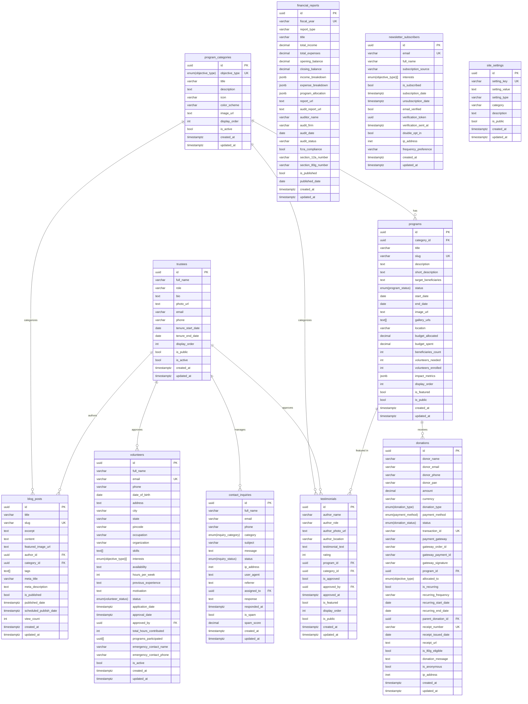

# Database Entity Relationship Diagram
## Nazma Charitable Trust

## Database Statistics

### Tables: 11
- program_categories
- trustees
- programs
- contact_inquiries
- volunteers
- donations
- financial_reports
- newsletter_subscribers
- testimonials
- site_settings
- blog_posts

### Enums: 8
- inquiry_status
- inquiry_category
- donation_type
- donation_status
- payment_method
- volunteer_status
- program_status
- objective_type

### Key Relationships:

1. **Program Categories → Programs**: One-to-Many
   - Each category has multiple programs

2. **Programs → Donations**: One-to-Many
   - Programs can receive donations

3. **Trustees → Contact Inquiries**: One-to-Many
   - Trustees can be assigned to handle inquiries

4. **Trustees → Volunteers**: One-to-Many
   - Trustees approve volunteer applications

5. **Programs → Testimonials**: One-to-Many
   - Testimonials can be linked to specific programs

6. **Trustees → Blog Posts**: One-to-Many
   - Trustees can author blog posts

### Indexes:

- Primary keys on all tables (UUID)
- Unique constraints on emails, slugs, transaction IDs
- Foreign key indexes for relationships
- Performance indexes on frequently queried fields (status, created_at, etc.)

### Security Features:

- Row Level Security (RLS) enabled on all tables
- Public read access for published content only
- Authenticated access required for sensitive data
- Form submissions allowed without authentication

### Automated Features:

- `updated_at` triggers on all tables
- Receipt number generation for donations
- Spam detection for contact forms
- Newsletter verification token generation
- Program statistics updates on donations
- Blog view count tracking
